# 🌙 Dylan Kai

Dylan Kai is a modern artist website built to capture the emotional universe surrounding the indie musician. More than a portfolio, the experience is designed as a digital extension of the artist's identity—immersive, atmospheric, and deeply connected to the themes present in his music.

Inspired by cinematic visuals, minimal interfaces, and Apple-inspired design principles, the website blends smooth interactions, ambient transitions, and carefully crafted typography to create a space where visitors can explore music, lyrics, visuals, and upcoming releases.

The project was created as a frontend and UI/UX design exercise, focusing on storytelling through interface design, responsive experiences, and modern web technologies.


## ✨ Features

- 🎵 Interactive music catalog & latest releases
- 📖 Dedicated lyrics and song pages
- 🎧 Featured album & immersive listening experience
- 📸 Visual gallery inspired by the artist's aesthetic
- 🎬 Cinematic page transitions and smooth animations
- 🌌 Ambient microinteractions throughout the interface
- 📅 Tour dates & upcoming events section
- 📰 News and release announcements
- 📱 Fully responsive design
- ⚡ Fast navigation and optimized performance


## 🧰 Tech Stack

- React
- React Router
- Framer Motion
- CSS (custom animations & glassmorphism UI)
- Vite


## 🎨 Design Philosophy

The interface reflects Dylan Kai's artistic universe through:

- Minimal, atmospheric layouts
- Cinematic typography
- Soft gradients and dark palettes
- Editorial-inspired compositions
- Fluid animations that reinforce emotion rather than distract
- A strong focus on storytelling and mood


## ⚙️ Notes

- This project was bootstrapped with Vite.
- Designed as a concept website for an independent music artist.
- Focuses on combining modern frontend development with immersive UI/UX design.


## 🚀 Live Demo

👉 https://dylan-kai.vercel.app


## 📸 Screenshots

### Home
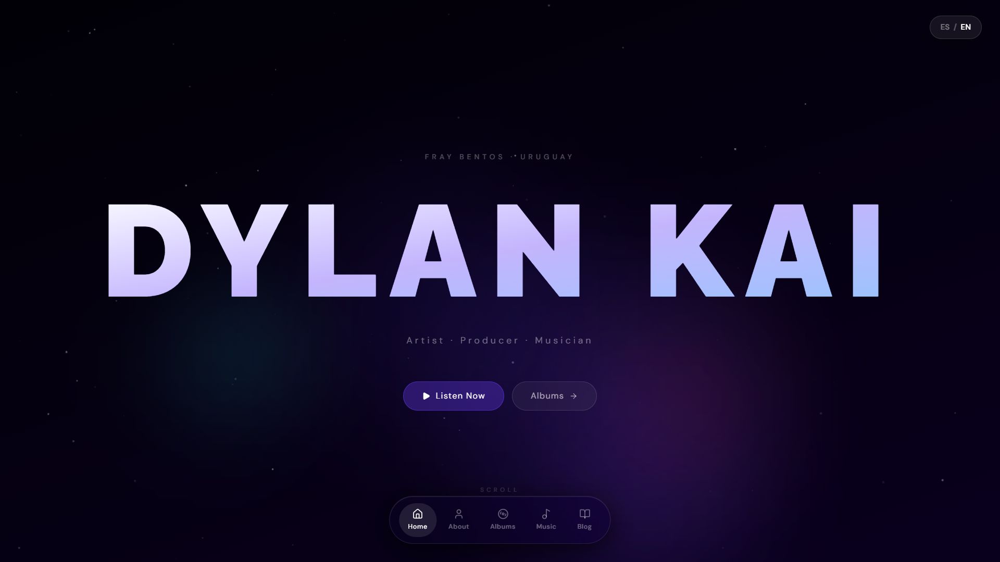
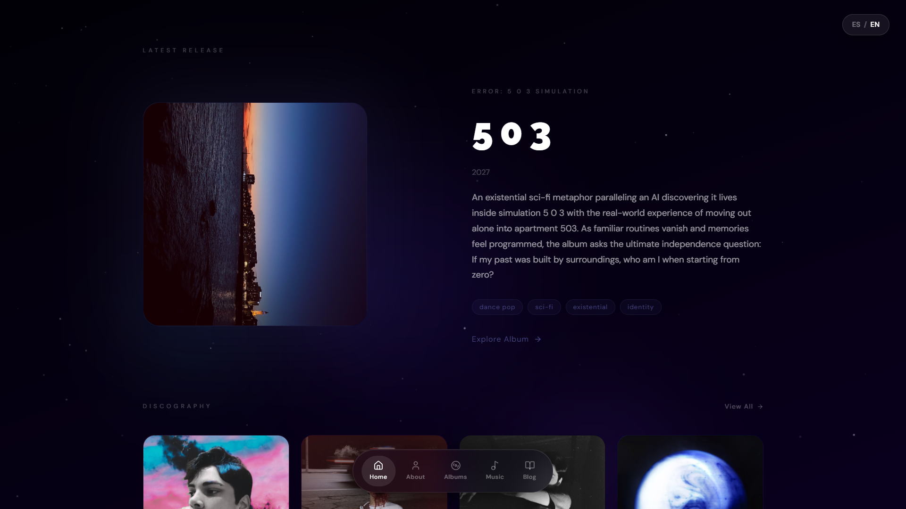
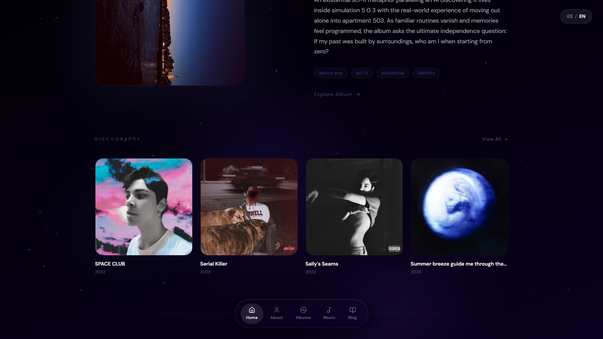

### Albums


### Album
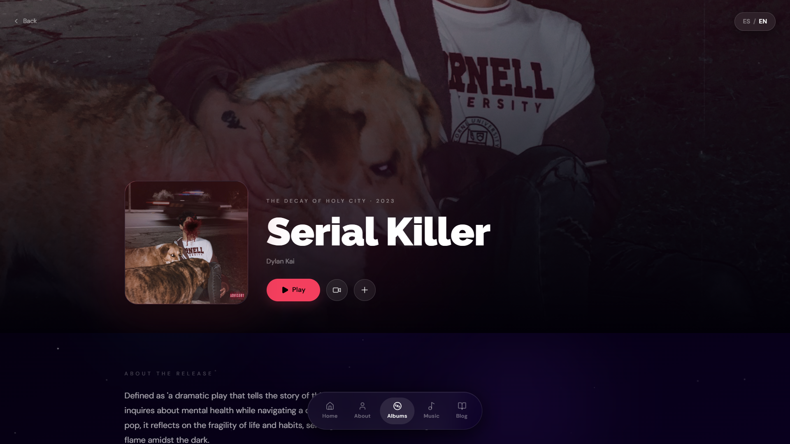
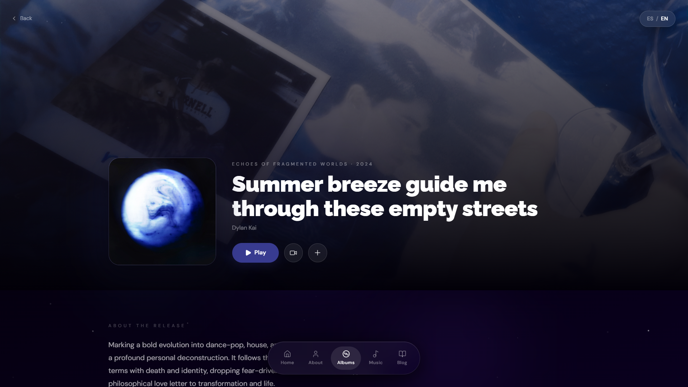
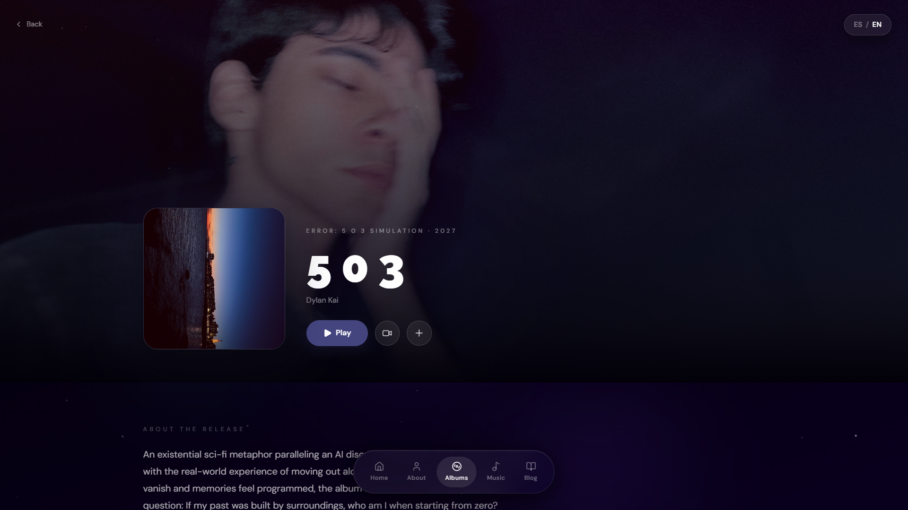
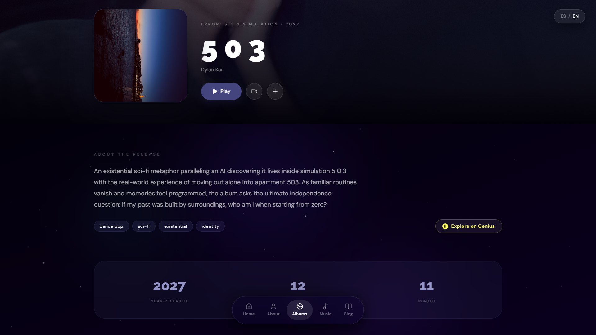
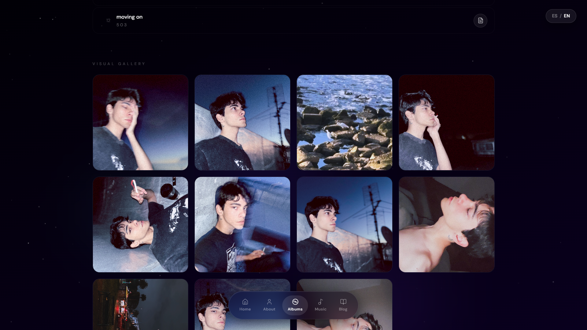

### Blog
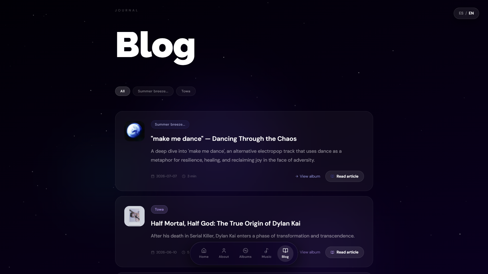
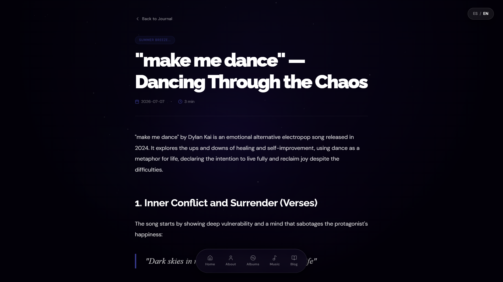
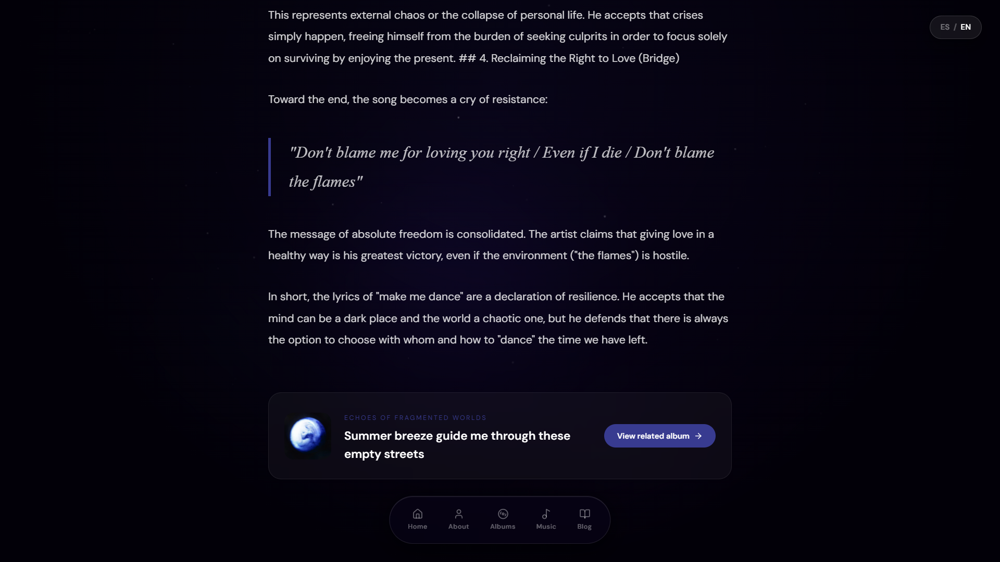
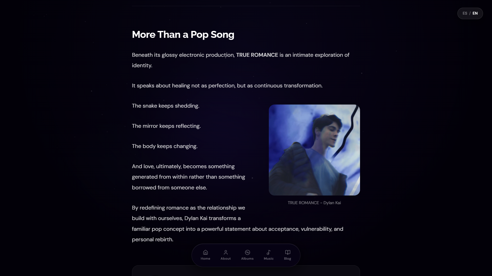

### About
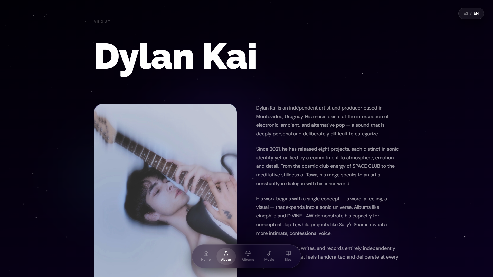

### Song Info & Lyrics
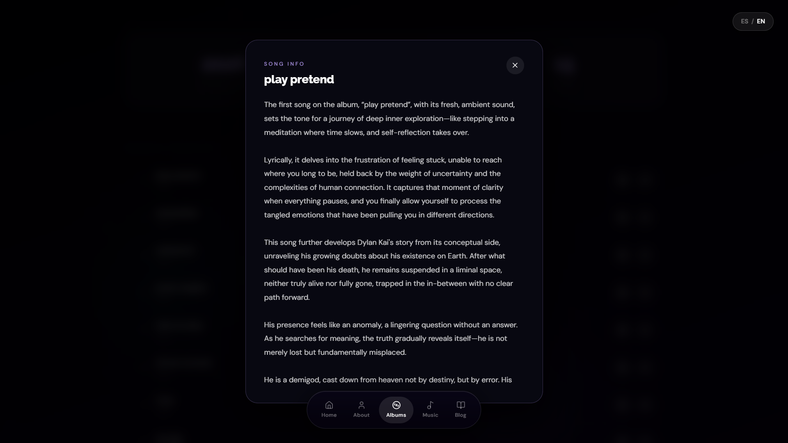
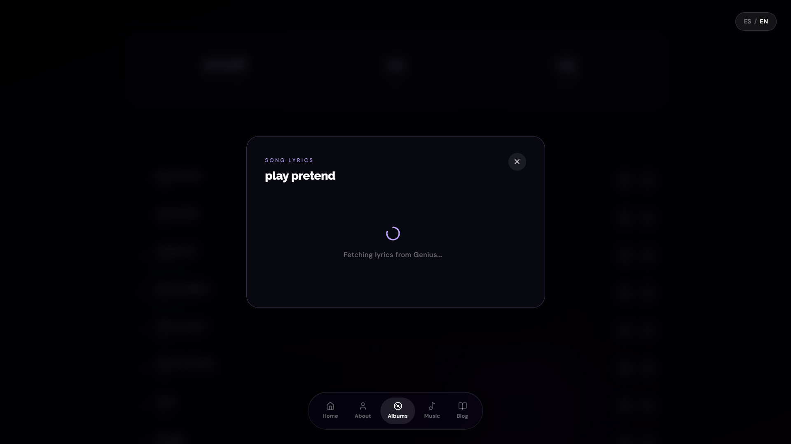

### Albums Menu
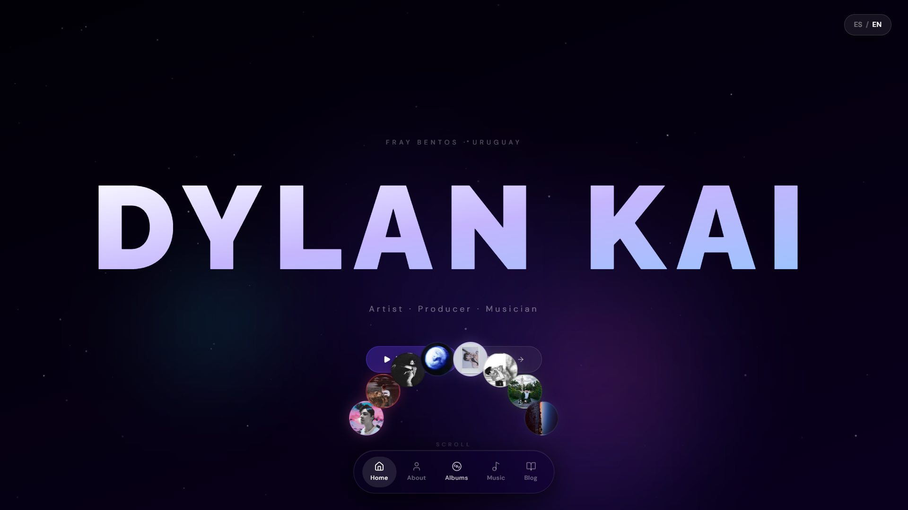


## 📦 Installation

```bash
git clone https://github.com/walterbardier/dylan-kai.git
cd dylan-kai
npm install
npm run dev
```